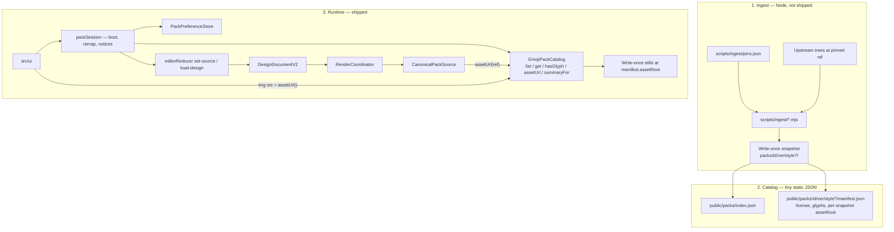
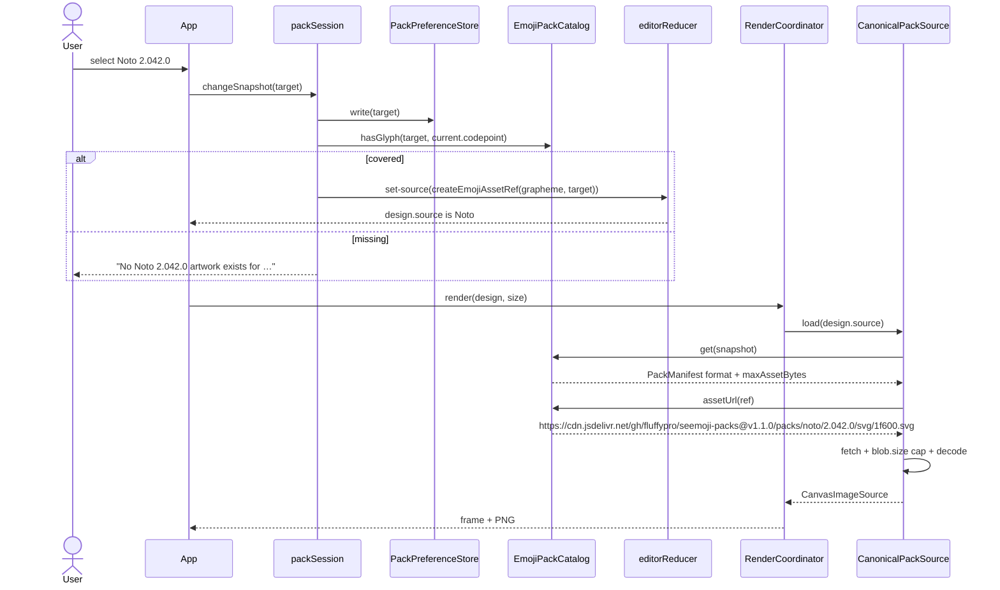

# Emoji pack swapping

| Field | Value |
| --- | --- |
| Author | seemoji engineering |
| Date | 2026-08-27 |
| Revised | 2026-08-28 |
| Status | Draft — rebased onto the canonical project workspace |
| Audience | Senior engineers working in this repository |

## Overview

> **Persistence baseline (2026-08-28):** the workspace uses canonical autosaved
> `Project` records in IndexedDB, compare-and-swap revisions, conflict-copy
> preservation, and cross-tab broadcasts. Pack work extends each project's
> `DesignDocument` source identity. It must not create a parallel snapshot store.

Seemoji is a local-first editor: pick an emoji, apply slight visual edits, and copy or download a transparent PNG. Artwork today is a single pinned source — `jdecked/twemoji` 15.1.0 SVG — fetched by `TwemojiCdnAssetSource` from jsDelivr. `EmojiAssetRef.pack` is the TypeScript literal `'twemoji'`, `decodeSource` in `src/domain/designCodec.ts` rejects any other pack, and `createEmojiAssetRef` always pins Twemoji 15.1.0.

This document describes how to swap among **allowlisted, open-source / permissive-license** emoji sets without turning the editor, renderer, or project workspace into pack-specific software. Packs are **versioned catalogs**. Pack-specific path chaos is solved **at ingest** (Node, not shipped). Runtime is **one loader** that fetches a canonical SVG or PNG still, plus a tiny catalog port for manifests, coverage, **and byte URLs**.

A project remains a snapshot of *this* artwork, not “whatever 😀 looks like on this machine.” The session’s default pack is an independent editor preference. Published snapshot trees are **write-once**: a recipe pins a pack version whose bytes must not move when a later pack is added.

## Background & Motivation

### Current architecture

The hexagonal layout in `README.md` is still the right map:

```text
UI event
   │
   ▼
editorReducer ─► WorkspaceController ─► ProjectRepository
                         │
                         └─────────────► WorkspaceSync
   │
   ▼
DesignDocumentV2
   │
   ▼
RenderCoordinator ◄────────── EmojiAssetSource
   ├────────► preview canvas
   └────────► prepared PNG ──► ClipboardPort / FileExportPort
```

Relevant facts in the tree today:

| Piece | Location | Behavior |
| --- | --- | --- |
| Asset identity | `src/domain/emoji.ts` | `pack: 'twemoji'`, `packVersion`, `codepoint`, `grapheme`. `toCodepoint` lowercases, dash-separates, strips U+FE0F. JSDoc currently says “filename used by Twemoji”. |
| Factory | `createEmojiAssetRef(grapheme)` | Always `{ pack: 'twemoji', packVersion: TWEMOJI_PACK_VERSION ('15.1.0'), ... }`. |
| Document | `src/domain/design.ts` | `DesignDocumentV2.layers[*].source: EmojiAssetRef` for emoji layers. Unknown versions rejected; V1 recipes promote to V2. |
| Codec | `src/domain/designCodec.ts` | **Whitelist constructor**: `source.pack !== 'twemoji'` → error; copies four fields; **silently drops extra keys**. Semver `packVersion` required. Grapheme/codepoint must agree. No `encodeDesignDocument`; persistence is `JSON.stringify` of the in-memory object. |
| Port | `src/ports/emojiAssetSource.ts` | `load(ref) → Promise<CanvasImageSource>`. |
| Adapter | `src/adapters/browser/twemojiAssetSource.ts` | jsDelivr `.../jdecked/twemoji@{ver}/assets/svg/{codepoint}.svg`. CORS, content-type `svg`, blob-URL decode, `URL.revokeObjectURL` in `finally`, in-memory promise cache. Canvas never points `src` at the CDN. |
| Coordinator | `src/application/renderCoordinator.ts` | `validateSource` is `load()`. Frame/PNG LRU keys are `JSON.stringify(design)`. Pack-agnostic. |
| Editor | `src/application/editor.ts` | `EditorState` owns the active V2 design, selection, export size, and bounded history. `set-source` updates the primary emoji layer. `load-design` opens a project and resets history. |
| Composition | `src/main.tsx` | Wires `TwemojiCdnAssetSource` + `BrowserCanvasRenderer`. |
| Picker | `src/ui/EmojiPicker.tsx` | 90 curated graphemes as **system-font text**. Paste uses `firstGrapheme`. |
| Selection | `src/ui/App.tsx` `selectEmoji` | `createEmojiAssetRef` then `renderer.validateSource` then `set-source`. |
| Footer | `src/ui/App.tsx` | Hardcoded Twemoji CC BY 4.0. |
| Notices | `src/ui/App.tsx` `showNotice` | `kind: 'status'` auto-clears after **4 seconds**. Errors persist until dismiss. |
| Copy / Download | `src/ui/Preview.tsx` | Copy success: `"Copied. Paste it into Discord."` Download: `fileExport.downloadPng` with **no notice**. |
| Projects | `src/ui/StarredProjectsBar.tsx` | Starred projects are a metadata view over canonical projects. Thumbnails render `project.design` at 64px and catch render failures. |
| Persistence | `src/adapters/browser/indexedDbProjectRepository.ts` | One IndexedDB record per project. Invalid records are skipped independently. Writes compare the expected revision transactionally; stale edits become separately identified conflict copies in `WorkspaceController`. |
| Cross-tab | `src/adapters/browser/browserWorkspaceSync.ts` | BroadcastChannel-primary, storage-event-fallback invalidations announce changed project IDs only. Idle tabs reload IndexedDB records; stale saves cannot overwrite a newer revision. |
| Planner | `src/domain/renderPlan.ts` | Affine + output-relative blur/outline. Does not read `source.pack`. |
| Renderer | `src/adapters/browser/canvasRenderer.ts` | `drawImage(asset, …)` + filters + outline. Pack-agnostic. |
| Boundaries | `src/architecture.test.ts` | domain / ports / application / `adapters/browser` must not import React, Preact, or `src/ui`. UI (`App.tsx`, `EmojiPicker.tsx`, `Preview.tsx`) imports application + domain only, not adapters. |
| Hosting | `docs/deployment.md` | Static Cloudflare Pages. No Functions, KV, R2, or server. |
| JS budget | `scripts/check-bundle-budget.mjs` | **128,000 raw / 40,000 gzip-9** across **all** emitted `.js` chunks. |
| e2e | `e2e/editor.spec.ts` | Playwright serves `dist/`, intercepts artwork, and includes two-tab project concurrency. Copy-reject text contains `No Twemoji`. `@visual` is Chromium-only. |
| Layout | `src/index.css` | Narrow overflow invariant: 620px two-column, 390×844 stacked with no horizontal overflow. Picker grid becomes 8 columns at 620px. |

Measured production JS after workspace recovery (2026-08-29): approximately
**121,400 raw / 37,600 gzip-9**. Glyph manifests and artwork remain outside the
JavaScript graph; see [JS budget](#js-budget).

### Pain points

1. **Identity is Twemoji-shaped.** The document already pins pack + version, but the type system and codec refuse to describe any other pack. The product invariant we want (projects are snapshots) is half-implemented.
2. **The picker lies.** Cells are system-font graphemes. Swapping the fetch source without swapping picker art would show Apple/Samsung/Segoe glyphs and export Twemoji (or Noto, or Fluent) pixels.
3. **Coverage is a 404.** `validateSource` is a network round-trip. That is acceptable for one paste. It is not acceptable as a way to discover which of ~3–4k glyphs a pack contains.
4. **Attribution is a footer string.** The product *is* modification plus PNG redistribution. License terms differ across packs (attribution, share-alike, BSD notice). That has to be data, not a README footnote.
5. **A Tauri shell is already anticipated** (`README.md`: replace `EmojiAssetSource`, leave editor/renderer alone). A forest of per-pack browser adapters would have to be rebuilt natively. A canonical snapshot plus one loader would not.

## Goals & Non-Goals

### Goals

- Allow the user to choose among **allowlisted** packs (and, when a pack has more than one listed snapshot, versions and styles) for **new** picks and paste.
- Keep every `DesignDocument` a **pinned snapshot**: pack id + semver + optional style + canonical codepoint + grapheme, with **write-once bytes** behind that version.
- Open a project **exactly as stored**. Never remap it onto the session pack. Never rewrite the session pack when opening a project.
- On an explicit pack / version / style switch of the *open* design: remap the same grapheme if the target snapshot covers it; otherwise keep the old `source` and tell the user. **Never silent-substitute** a different grapheme or a fallback glyph.
- Show **pack artwork** in the picker, filtered by that snapshot’s coverage.
- Derive footer attribution from the **current design’s** pack via `PackSummary` (not the glyph manifest). Offer an about/licenses surface for the full allowlist.
- Treat **CC-BY-SA** as a flagged class and surface it **before** Copy / Download with a persistent hint.
- Add a pack by **ingest mapping + data**, not a new class in `src/adapters/browser`.
- Keep the existing hexagonal boundaries, local-first model, Canvas 2D renderer, and PNG export sizes (48 / 128 / 256).
- Preserve DesignDocument **version 2** unless codepoint meaning changes.

### Non-goals

- Accounts, sync, backend, Discord bots, automatic client injection (already out of scope in `README.md`).
- Animated emoji, Noto animations, Fluent 3D **GLB**, COLRv1 fonts, Lottie.
- Shipping proprietary artwork: Apple, Segoe UI Emoji, Samsung, WhatsApp, Facebook, OEM Android, current JoyPixels, Icons8.
- Ingesting Noto **fonts** (OFL). SVG stills under Apache-2.0 only. Do not fold `third_party/region-flags` PNGs into the Noto SVG snapshot.
- Ingesting OpenMoji extras / PUA (`E000–F8FF`, `data/extras-openmoji.csv`, extra-unicode). Unicode emoji stills only.
- Using Segoe UI Emoji because Fluent exists. Fluent UI Emoji (MIT stills) ≠ the Windows font.
- A feature-flag service or remote config.
- Putting glyphs on Cloudflare Pages / into the Vite JS graph.
- Runtime dependency on svgmoji, emojibase, or similar.
- Changing blur/outline from output-relative units, or making `createRenderPlan` pack-aware.
- Per-pack visual tuning of the renderer (glyph padding, pixel-art scale). If Serenity pixel art looks soft at 256px, that is a later, explicit render-plan option, not part of this design.
- A `RegistryAssetSource` dispatcher or a `urlTemplate` type in shipped JS. One locator: `EmojiPackCatalog.assetUrl`.

## Product invariant

A project is a snapshot of **this** artwork, not “whatever 😀 looks like on this machine.”

| Concept | Lives in | Lifetime |
| --- | --- | --- |
| Recipe identity | `DesignDocument.source`: `pack` + `packVersion` + optional `style` + `codepoint` + `grapheme` | As long as the document / project exists |
| Bytes for that identity | Write-once tree `packs/<id>/<ver>/[<style>/]` at `PackManifest.assetRoot` (not stored on the recipe; the version name is the pin) | Forever for that `packVersion`. A pixel change requires a new `packVersion`. |
| Session default pack | Editor preference (`seemoji:pack-preference:v1`) | Until the user changes pack, version, or style in the selector |
| Coverage | Pack manifest `glyphs` | Frozen with that snapshot version |
| Loader cache | `CanonicalPackSource` / `RenderCoordinator` | Process lifetime |

Consequences:

- Opening a project uses `load-design` with `project.design`. The session pack **does not** change, and the recipe **is not** rewritten to the session pack.
- New picker clicks and paste build a ref from the **session** snapshot.
- Footer / share-alike copy read the **design** pack, which can differ from the session pack (a Twemoji project while the picker is on Noto). That mismatch is allowed and expected after opening a project and after boot.
- Pack / version / style switch of the open design is an explicit remap of the current grapheme, not a theme change.
- Regenerating Twemoji 15.1.0 in a later ingest is **forbidden**. New pixels are a new `packVersion`.

## Proposed Design

### Three layers

Do not grow one runtime adapter per pack. Do not treat a pack as a font-family or CSS theme.



Adding a pack is: a `pins.json` entry, an ingest script, generated manifests in `public/packs/`, an allowlist entry, and stills published under a **new** snapshot-repo tag that does not rewrite older `packs/<id>/<ver>/` trees. It is not a new `*AssetSource` class.

There is **no** `RegistryAssetSource` and **no** `urlTemplate` field in code. The only locator is `EmojiPackCatalog.assetUrl(ref)`. If a published manifest’s `assetRoot` happens to be an upstream jsDelivr tree, that is catalog *data*, still returned through `assetUrl`. PR 3 does not merge until a real snapshot host exists and e2e intercepts it.

### Bytes pinning (write-once)

`EmojiAssetRef` stores a *name* (`pack` + `packVersion` + optional `style`), not a content hash. That is a snapshot **only if** the name is immutable:

1. A published tree `packs/<id>/<version>/[<style>/]` is **write-once**. Changing any still, any glyph list, or `defaultStyle` requires a **new** `packVersion`.
2. `PackManifest.assetRoot` is **per snapshot**, not a floating repo-level tag on `index.json`. Adding Noto must not rewrite Twemoji 15.1.0’s `assetRoot`.
3. Git tags on the snapshot repo are **append-only**. Never force-push, never delete a tag that any shipped manifest points at. Keep old tags forever.
4. `manifest.upstream.ref` records the exact upstream tag or SHA ingested for that version. Documents do **not** store that SHA (keeps DesignDocument V2).
5. `defaultStyle` on a version’s summary/manifest is frozen with that version. Omitted `style` on a recipe means “that pinned version’s default,” which cannot later change.

Monorepo tag scheme: `vMAJOR.MINOR.PATCH` on `fluffypro/seemoji-packs` (same GitHub owner as this app; override in `pins.json` if the Pages-owning account differs).

| Tag | Contents | Manifest `assetRoot` examples |
| --- | --- | --- |
| `v1.0.0` | Twemoji 15.1.0 stills only | Twemoji 15.1.0 → `https://cdn.jsdelivr.net/gh/fluffypro/seemoji-packs@v1.0.0/` |
| `v1.1.0` | Previous trees **byte-identical** + Noto + Fluent color | Noto/Fluent → `@v1.1.0/`. Twemoji 15.1.0 **stays** `@v1.0.0/`. |

jsDelivr serves git tags. A later tag may *contain* a copy of old trees; recipes must not be retargeted to that later tag.

### Canonical Unicode key

Keep `toCodepoint` in `src/domain/emoji.ts` as the document key:

- lowercase hex
- dash-separated
- U+FE0F stripped
- ZWJ sequences preserved (`👨‍👩‍👧‍👦` → `1f468-200d-1f469-200d-1f467-200d-1f466`)

Update its JSDoc in PR 1 from “filename used by Twemoji” to: **canonical Unicode key (lowercase, dash-separated, FE0F stripped)**.

Pack-specific filenames stay in ingest. `toCodepoint` takes a **grapheme**, never a hex dump.

| Pack | Upstream | Canonical mapping |
| --- | --- | --- |
| Twemoji | `assets/svg/1f600.svg` | filename is already the key |
| Noto SVG | `svg/emoji_u1f600.svg`, `emoji_u1f468_200d_1f469.svg` | strip `emoji_u`, `_` → `-`. **Do not** ingest `third_party/region-flags`. Flags present in `svg/` are included; flags only in the font’s transformed PNGs are coverage holes. |
| Fluent | `metadata.json` + style + skin folders | Default: `toCodepoint(metadata.glyph)`. Skintones: parse each `unicodeSkintones` hex sequence to a grapheme, then `toCodepoint` (see [Fluent mapping](#fluent-mapping)). Do not invent `glyphSkintones`. Do not use the hex dump as a filename. |
| OpenMoji | `color/svg/1F600.svg` | lowercase. **Skip** extras/PUA/extra-unicode. |
| FxEmoji | `u1F60A-smileeyes.svg` (complete glyph, not `.layerN`) | strip `u`, drop the name suffix |
| EmojiTwo | EmojiOne-style hex filenames | lowercase, FE0F policy applied |
| Blobmoji | Noto-like `emoji_u*.svg` | same as Noto |
| SerenityOS | `Base/res/emoji/U+1F600.png`, ZWJ `U+1F468_U+200D_U+1F469.png` | strip `U+`, `_` → `-`, lowercase |

If upstream includes FE0F in a filename, ingest records the canonical (stripped) key and copies the file once. Documents never contain pack-native names.

### Canonical snapshot layout

```text
packs/<id>/<version>/
  manifest.json                 # unstyled packs (Twemoji, Noto, …)
  svg/<codepoint>.svg           # or png/<codepoint>.png
packs/<id>/<version>/<style>/
  manifest.json                 # Fluent color; OpenMoji color
  svg/<codepoint>.svg
```

`version` is **our snapshot semver** (`^\d+\.\d+\.\d+$`, already required by the codec). Assignment rule is in the [ingest contract](#ingest-contract). Documents pin *our* semver; they never pin a git SHA.

### Ingest contract

New tree, not in the Vite graph, not in `src/architecture.test.ts`, not in the JS budget:

```text
scripts/ingest/pins.json
scripts/ingest/canonical.mjs      # shared: version map, manifest write, write-once check
scripts/ingest/twemoji.mjs
scripts/ingest/noto.mjs           # PR 4
scripts/ingest/fluent.mjs         # PR 4
scripts/ingest/openmoji.mjs       # PR 5
scripts/ingest/fxemoji.mjs        # PR 6
scripts/ingest/emojitwo.mjs
scripts/ingest/blobmoji.mjs
scripts/ingest/serenity.mjs
scripts/ingest/publish.mjs        # copies stills into the snapshot-repo clone and tags
```

`.gitignore` this repo: `.tmp-packs/`. **Never** commit stills here. Vite would not JS-bundle them unless imported, but 100–200 MB must not land in git or in `dist/`.

#### `pins.json`

```json
{
  "snapshotRepo": "fluffypro/seemoji-packs",
  "packs": {
    "twemoji": {
      "repository": "https://github.com/jdecked/twemoji",
      "ref": "v15.1.0",
      "snapshotVersion": "15.1.0",
      "format": "svg"
    }
  }
}
```

Later packs add keys. `snapshotRepo` is the GitHub `owner/name` published to jsDelivr. If the Pages-owning account is not `fluffypro`, change this one field (and existing `assetRoot`s only for **new** versions).

#### Version assignment

Always emit `x.y.z` for `packVersion`:

| Upstream `ref` | Snapshot `packVersion` |
| --- | --- |
| already `x.y.z` or `vX.Y.Z` (Twemoji `v15.1.0`) | `15.1.0` (strip optional `v`) |
| two-component `v?X.Y` (OpenMoji `17.0`, Noto `v2.042`) | `X.Y.0` → `17.0.0`, `2.042.0` |
| git SHA / unversioned main (Fluent, Serenity) | our incrementing `1.0.0`, `1.1.0`, … recorded in `pins.json` |

`manifest.upstream` is `{ repository, ref }` with the **unmodified** upstream tag or SHA.

#### Outputs

| Output | Location | Committed in this repo? |
| --- | --- | --- |
| Index | `public/packs/index.json` | yes |
| Per-snapshot manifest (incl. `glyphs`, `assetRoot`) | `public/packs/<id>/<ver>/[style/]manifest.json` | yes |
| Stills staging | `.tmp-packs/` | **no** (gitignored) |
| Published stills | `fluffypro/seemoji-packs` at an **new** tag | separate repository |

`publish.mjs` must refuse to tag if any already-published `packs/<id>/<ver>/` path would change bytes (write-once check against the previous tag).

#### Noto flags

Noto’s README: font flags are transformed PNGs from `third_party/region-flags` (public domain); `svg/` does not reproduce those transforms. Ingest **`svg/` only**. Missing flags are coverage holes — no silent PD-PNG substitute into a Noto recipe.

#### Fluent mapping

Upstream `metadata.json` has `glyph` (default grapheme) and optional `unicodeSkintones` (space-separated hex sequences, including ZWJ, e.g. `"1f3c3 1f3fb 200d 27a1 fe0f"`). There is **no** `glyphSkintones` field. Skin-tone stills live under `Default/` / `Light/` / `Medium-Light/` / `Medium/` / `Medium-Dark/` / `Dark/`, each containing style folders (`Color/`, …). Hex strings are never filenames; every document key still goes through `toCodepoint` on a grapheme.

```ts
const FLUENT_SKIN_FOLDERS = [
  'Default',
  'Light',
  'Medium-Light',
  'Medium',
  'Medium-Dark',
  'Dark',
] as const;

function graphemeFromUnicodeHex(sequence: string): string {
  const parts = sequence.trim().split(/\s+/).filter(Boolean);
  return String.fromCodePoint(
    ...parts.map((part) => {
      const value = Number.parseInt(part, 16);
      if (!Number.isInteger(value)) throw new Error(`invalid hex ${part}`);
      return value;
    }),
  );
}
```

For each emoji folder:

- Default key: `toCodepoint(metadata.glyph)`. Copy the still from `Color/` (or `Default/Color/` when skin folders exist).
- Skintones: if `unicodeSkintones` is present, require `unicodeSkintones.length === FLUENT_SKIN_FOLDERS.length`. For index `i`, key = `toCodepoint(graphemeFromUnicodeHex(unicodeSkintones[i]))`, file = `${FLUENT_SKIN_FOLDERS[i]}/Color/…`. Fail ingest on length mismatch rather than guessing.
- Style directory: `Color` → `color` (PR 4). Later `Flat` → `flat`, `High Contrast` → `high-contrast`. Skip `3D` GLB; PNG 3D stills are a follow-up style with a higher `maxAssetBytes`.

Do **not** pass `metadata.unicode` / `unicodeSkintones` strings to `toCodepoint` (that helper takes a grapheme, not a hex dump). Parse hex → grapheme → `toCodepoint`.

#### OpenMoji extras

Do **not** ingest `extra-unicode`, `extras-openmoji`, or codepoints in `E000–F8FF`. Paste of a PUA character is a coverage miss.

#### CI

`.github/workflows/ingest-check.yml` (active on PRs that touch `scripts/ingest/**` or `public/packs/**`): run the ingest scripts in **manifest-only** mode against `pins.json` and fail if the committed `public/packs/**/manifest.json` is stale or if any glyph is missing from `.tmp-packs` when stills are requested. Publishing tags is **manual** (`publish.mjs`) until we trust write-once; it is not a paragraph in a PR description.

#### Quantities (order of magnitude)

| Pack | Glyphs | Typical still | Full set |
| --- | --- | --- | --- |
| Twemoji 15.1 SVG | ~3.6–3.8k | 1–15 KB SVG | ~10–20 MB |
| Noto `svg/` | ~3–4k | similar | ~15–30 MB |
| Fluent `color` | ~1.5–3.5k | SVG | ~20–40 MB |
| OpenMoji color (Unicode only) | ~3–4k | SVG | ~15–25 MB |
| FxEmoji / EmojiTwo | incomplete; older Unicode | SVG | a few MB |
| Blobmoji | Noto-fork scale | SVG | ~15–30 MB |
| SerenityOS | ~1.7k | tiny PNG | < 1 MB |

Eight full sets are on the order of **100–200 MB**.

Committed JSON only:

- Index: ~2–4 KB.
- One glyph list: ~3.5k × ~12 bytes ≈ **40–60 KB** JSON, **~8–15 KB gzip**.
- Eight manifests: ~100 KB gzip total. `scripts/check-bundle-budget.mjs` only sums `.js`.

### Layer 2 — catalog

New port `src/ports/emojiPackCatalog.ts`. UI and application never concatenate CDN hosts. **One** method returns still URLs; loader and picker both call it.

```ts
import type { DecodeResult } from '../domain/designCodec';
import type { EmojiAssetRef } from '../domain/emoji';
import type { PackManifest, PackSnapshot, PackSummary } from '../domain/pack';

export interface EmojiPackCatalog {
  /** Unknown pack ids dropped. Never throws: failure is `{ ok: false }`. */
  list(): Promise<DecodeResult<readonly PackSummary[]>>;
  /** Full manifest including glyphs + per-snapshot `assetRoot`. */
  get(snapshot: PackSnapshot): Promise<DecodeResult<PackManifest>>;
  /**
   * Coverage gate. Returns false on missing snapshot, style not in pack,
   * network/decode failure, or codepoint not listed. Never throws. Never 404-probes stills.
   */
  hasGlyph(snapshot: PackSnapshot, codepoint: string): Promise<boolean>;
  /**
   * Absolute URL of the still. The only locator in the system.
   * CanonicalPackSource.load and picker  both call this.
   */
  assetUrl(ref: EmojiAssetRef): Promise<DecodeResult<URL>>;
  /**
   * Index lookup for footer / share-alike. Does not fetch `glyphs`.
   * Null if that pack id is not in the last successful list().
   */
  summaryFor(ref: Pick<EmojiAssetRef, 'pack'>): Promise<PackSummary | null>;
}
```

Browser adapter `src/adapters/browser/httpEmojiPackCatalog.ts`:

- Constructor: `{ indexUrl: '/packs/index.json' }`. No fallback asset host.
- `list()` fetches same-origin index once, `decodePackIndex`, filters `packs` through `isPackId`, caches summaries.
- `get()` path selection (do **not** mutate the ref):
  1. If `snapshot.style` is a string: if `list()` has succeeded and that style is not in `summary.styles`, return `{ ok: false }`. Else fetch `/packs/<id>/<ver>/<style>/manifest.json`.
  2. If `style` is omitted: **first** fetch `/packs/<id>/<ver>/manifest.json` (unstyled tree). This must not wait on `list()`. Only if that request 404s **and** `defaultStyle` is already known from a successful `list()`, retry `/packs/<id>/<ver>/<defaultStyle>/manifest.json`.
  3. `decodePackManifest`, cache, build a `Set` of glyphs.
- `hasGlyph` is `get` then `set.has`; any `!ok` → `false`.
- `assetUrl`:
  1. Reject refs that fail `SAFE_VERSION` / `SAFE_CODEPOINT`. Apply `SAFE_STYLE` **only when `typeof ref.style === 'string'`**. Omitted / `undefined` style is valid and means the unstyled or pack-default tree (Twemoji, Noto, default-style omit). `SAFE_STYLE.test(undefined)` must not run.
  2. `get(snapshot)` (cached).
  3. If `ref.style` is a string and `manifest.style` is a string and they disagree, fail. Keep this check; it does not apply when style is omitted.
  4. `new URL(\`${manifest.format}/${ref.codepoint}.${manifest.format}\`, manifest.assetRoot)` where `assetRoot` is a directory URL ending in `/`. For unstyled trees the root is `…/packs/<id>/<ver>/`; for styled, `…/packs/<id>/<ver>/<style>/`. `assetRoot` already includes that prefix (ingest writes it that way) so the loader does not re-concatenate pack id.
  5. Require `https:` (or `http:` only for Playwright’s `127.0.0.1`). Reject `..`, `@latest`, and non-allowlisted hosts (jsDelivr + same-origin).
- `summaryFor` is an in-memory lookup of the last successful `list()`; it does not GET a manifest.

#### Catalog JSON decoders

New `src/domain/packCodec.ts` using the same `DecodeResult` posture as `designCodec.ts`:

- `decodePackIndex(value)` — `version === 1`, `packs` array; each element `decodePackSummary`; skip entries whose `id` fails `isPackId` (do not fail the whole index).
- `decodePackManifest(value)` — required: `id` (`isPackId`), `name`, `version` (`PACK_VERSION`), `style` (`isPackStyle` or JSON `null` → `null`), `format` (`svg` | `png`), `license`, `unicodeLevel`, `glyphs` (array of `CODEPOINT` strings), `assetRoot` (non-empty string URL), `upstream.repository`, `upstream.ref`. Optional `maxAssetBytes` (finite positive integer, default 524288).
- `decodePackLicense` — `spdx`, `attribution`, `shareAlike` boolean, `noticeUrl`.
- Extra unknown keys dropped (whitelist constructors, same as `decodeSource`).

`PackManifest` does **not** extend `PackSummary`. Summaries carry `versions[]` / `defaultVersion` (index-level). Manifests carry one `version`, one `style`, glyphs, and `assetRoot`. Shared fields (`id`, `name`, `license`, `unicodeLevel`) are duplicated, not inherited, so a per-version file is not a fake index row.

#### Failure behavior (must not blank the editor)

| Event | Behavior |
| --- | --- |
| Index 404 / 5xx / CORS / corrupt JSON | `list()` → `{ ok: false, error }`. App `showNotice` error, treats packs as empty. Selector hidden. Session pack stays `DEFAULT_PACK_SNAPSHOT`. Footer uses the **hardcoded Twemoji CC BY 4.0** fallback until a successful `list()`. Preview still renders via the asset source. Coverage must still `get()` the unstyled default-pack manifest (`/packs/twemoji/15.1.0/manifest.json`) so the picker and paste are not fail-closed. |
| `list().value.length === 0` | Same as single-pack gate: hide selector. Coverage still uses the unstyled Twemoji manifest if it loaded. |
| `list().value.length === 1` | Hide selector (natural feature gate). |
| Unstyled `get` 404, `defaultStyle` known | Retry styled path. If both fail → `{ ok: false }`. |
| Manifest 404 / corrupt for `get` after fallback | `{ ok: false }`. `hasGlyph` → `false` (coverage miss, not crash). |
| Style not in pack | `get` / `assetUrl` fail; `hasGlyph` false. User-facing remap/paste copy uses `artworkMissingMessage` only for missing **glyphs**. Style errors use `No {name} artwork in the “{style}” style`. |
| `hasGlyph` internals throw | Catch → `false`. |

Do **not** fail-close the editor because one project record is corrupt. The repository isolates
decode failures per IndexedDB key, reports them through `WorkspaceSnapshot.issues`, and keeps every
other valid project available.

#### HTTP cache

`public/_headers` (Cloudflare Pages, copied to `dist/`):

```text
/packs/index.json
  Cache-Control: no-cache

/packs/*
  Cache-Control: public, max-age=31536000, immutable
```

Index is the only mutating catalog file (new packs/versions). Per-version manifests are write-once, hence immutable. No content-hash in JS is required.

### Layer 3 — runtime loader

One class, `src/adapters/browser/canonicalPackSource.ts`, implementing the existing `EmojiAssetSource`:

```ts
load(ref: EmojiAssetRef): Promise<CanvasImageSource>
```

Constructor: `{ catalog: EmojiPackCatalog }` only. **No boot-time URL fallback.**

Algorithm:

1. `catalog.get({ pack: ref.pack, packVersion: ref.packVersion, style: ref.style })`. This is the same cached `get` that `assetUrl` uses internally. If `!ok`, throw `EmojiAssetError` (`kind: 'missing'`). Keep the `PackManifest` — `load` needs `format` and `maxAssetBytes`, which `assetUrl` does not return. Do **not** widen `assetUrl` to `{ url, manifest }`.
2. `catalog.assetUrl(ref)`. If `!ok`, throw `EmojiAssetError` (`kind: 'invalid-ref'` or `'missing'`).
3. `fetch(url, { mode: 'cors', credentials: 'omit' })`.
4. Require HTTP 200.
5. `const blob = await response.blob()`. Cap with **`blob.size`** (Content-Length is optional) against `manifest.maxAssetBytes` (default **524288**). This bound is for SVG and small PNG. A later Fluent 3D PNG style sets a higher per-manifest cap; do not treat 512 KiB as a forever global.
6. Validate `Content-Type` against `manifest.format`: SVG must include `svg`; PNG must include `png`. Implement **both** branches in this class from day one (PR 3), even while only SVG packs ship.
7. Decode with the blob-URL `Image` path extracted from `twemojiAssetSource.ts`. Revoke the object URL in `finally`, as today.
8. Cache by `pack@version/style?/codepoint`, not by URL. Drop the entry on failure.

`RenderCoordinator` stays unchanged: it already calls `this.#assets.load(design.source)`. LRU keys include the widened ref via `JSON.stringify(design)`, so a pack change is a cache miss automatically.

`src/main.tsx`:

```ts
const catalog = new HttpEmojiPackCatalog({ indexUrl: '/packs/index.json' });
const assets = new CanonicalPackSource({ catalog });
```

UI components do not import jsDelivr, `twemojiSvgUrl`, or path helpers. They call `services.catalog.assetUrl` / `summaryFor` / `list`.

Future Tauri: implement the same two ports against bundled files. `editorReducer`, `createRenderPlan`, `BrowserCanvasRenderer`, clipboard, and projects do not change.

### Session preference vs design source

New port `src/ports/packPreference.ts` and adapter `src/adapters/browser/localPackPreferenceStore.ts`.

Storage key: `seemoji:pack-preference:v1`.

```ts
export interface PackPreferenceStore {
  read(): Promise<PackSnapshot | null>;
  write(preference: PackSnapshot): Promise<void>;
}
```

Envelope (decode with a small `decodePackPreference` in `packCodec.ts`):

```json
{
  "version": 1,
  "pack": "fluent",
  "packVersion": "1.0.0",
  "style": "flat"
}
```

Persist `style` when the pack has styles; **omit** the key when unstyled or when the style is the pack default (same omit rule as `EmojiAssetRef`).

Fail-open (never take the app down):

| Stored preference | Resolved session snapshot |
| --- | --- |
| missing / corrupt JSON / unknown `pack` | `DEFAULT_PACK_SNAPSHOT` |
| known pack, `packVersion` **still listed** in `summary.versions` | keep that version (no auto-upgrade) |
| known pack, `packVersion` **retired** (not in `versions`) | same pack, `defaultVersion`, style if still valid else `defaultStyle` |
| `style` not in `summary.styles` | drop to `defaultStyle` (or omit) |

Retiring 15.1.0 from the catalog is the only way a stored 15.1.0 moves. Shipping 16.0.0 *alongside* 15.1.0 does not rewrite the preference.

`AppServices`:

```ts
export interface AppServices {
  readonly renderer: RenderCoordinator;
  readonly clipboard: ClipboardPort;
  readonly fileExport: FileExportPort;
  readonly workspace: WorkspaceController;
  readonly catalog: EmojiPackCatalog;
  readonly packPreference: PackPreferenceStore;
}
```

`editorReducer` does **not** store the session pack.

### Boot sequence

`DEFAULT_DESIGN` remains Twemoji 😀 (`src/domain/design.ts`). First paint and the Chromium `@visual` golden depend on that.

On load:

1. `WorkspaceController.load()` opens or creates the canonical active project. Editing remains gated until its strictly decoded design is available.
2. In parallel, `get({ pack: 'twemoji', packVersion: '15.1.0' })` via the unstyled path. When the default coverage batch settles, omit uncovered curated cells. If it fails, keep full `CURATED`.
3. `catalog.list()`. On failure: notice, hardcoded footer, hidden selector. Do **not** clear the picker; default coverage remains usable.
4. `packPreference.read()`, then resolve against the list using the fail-open table.
5. Set **selector / session snapshot** to that result.
6. **Do not** remap the opened project's design on boot. A returning visitor may see a Noto selector with a Twemoji project until they explicitly change the selector or pick a cell. `DEFAULT_DESIGN` matters only when the workspace creates a new project.

Remap of the open design happens only when the user **changes** pack, version, or style in the selector.

`load-design` while opening a project does **not** write `packPreference`.

### Remap (pack / version / style switch of the open design)

Application helper (not the reducer, not the UI):

```ts
// src/application/remapSource.ts
export function artworkMissingMessage(
  packName: string,
  packVersion: string,
  grapheme: string,
): string {
  return `No ${packName} ${packVersion} artwork exists for ${grapheme}`;
}

export async function remapSource(
  current: EmojiAssetRef,
  target: PackSnapshot,
  catalog: EmojiPackCatalog,
): Promise<DecodeResult<EmojiAssetRef>> {
  const summary = await catalog.summaryFor({ pack: target.pack });
  const name = summary?.name ?? target.pack;
  if (!(await catalog.hasGlyph(target, current.codepoint))) {
    return {
      ok: false,
      error: artworkMissingMessage(name, target.packVersion, current.grapheme),
    };
  }
  return { ok: true, value: createEmojiAssetRef(current.grapheme, target) };
}
```

Paste coverage misses, remap misses, and loader missing-file user copy **share** `artworkMissingMessage` with `PackSummary.name` (“Twemoji”, not `twemoji`). Current e2e `toContainText('No Twemoji')` keeps passing.

`packSession` (see below) on selector change:

1. `packPreference.write(target)`.
2. `remapSource(editor.design.source, target, catalog)`.
3. If `ok`, `dispatch({ type: 'set-source', source })`.
4. If not, `showNotice({ kind: 'error', message })` and **leave `design.source` alone**.

Style change is the same path (`target` includes `style`). Version change is the same path.

Do not add `set-pack` to `editorReducer`.

### Version and style UI

The selector is **not** pack-only.

| Control | Shown when |
| --- | --- |
| Pack `<select>` | `list().value.length > 1` |
| Version `<select>` | selected pack’s `versions.length > 1` |
| Style `<select>` | selected pack’s `styles.length > 1` |

PR 4 Fluent ships `styles: ['color']` — **no** style control. OpenMoji color-only — no style control. A later Fluent `flat` addition shows the style select.

Choosing a pack:

- If the preference already has that pack and its `packVersion` is still listed, keep it.
- Else use `defaultVersion` (first-time pick of that pack, not a silent upgrade of a listed version).
- Style: keep if still listed, else `defaultStyle`.

Layout (preserve the 390×844 no-horizontal-overflow invariant):

```text
Picker panel
┌──────────────────────────────┐
│ Pack                 [ v ]   │  width 100%; min-width: 0
│ Version              [ v ]   │  only if versions.length > 1
│ Style                [ v ]   │  only if styles.length > 1
├──────────────────────────────┤
│ 8-col emoji grid (img cells) │
└──────────────────────────────┘
```

On viewports `> 940px`, pack and version may sit on one row **if** they wrap (`flex-wrap`) and each select `min-width: 0`. Never three controls in one non-wrapping row at 390px.

### Picker

`CURATED` in `src/ui/EmojiPicker.tsx` stays a product-curated grapheme list (90 smileys/gestures). It is **not** coverage. Uncovered curated cells are **omitted** (grid shrinks), not disabled — **after** a `hasGlyph` batch for the current session snapshot has resolved.

Until that first batch resolves, keep showing the **last-known** filtered set, or **full `CURATED`** if there is no last-known (first paint = today’s 90 cells, not an empty grid). Never paint zero cells as a loading state.

On session snapshot change:

1. Keep the last-known / full `CURATED` grid on screen.
2. `hasGlyph` each curated codepoint (manifest is cached after the first `get`; omitted-style `get` hits the unstyled path without waiting on `list()`).
3. When that batch settles, omit uncovered cells and paint remaining cells with pack art: `` where `url` comes from `catalog.assetUrl(createEmojiAssetRef(g, session))`. **Not** `RenderCoordinator` (that applies edits).
4. If `list()` failed but the unstyled default-pack manifest (`/packs/twemoji/15.1.0/manifest.json`) loaded, filter through **that** glyph set — do not replace the grid with zero cells. If even that `get` failed, keep full `CURATED` (PR 2 still system-font) rather than emptying the picker.

v1 is one `` per visible cell (~90 requests on first pack switch, HTTP-cached, then a second fetch when `CanonicalPackSource.load` runs for the selection — same URL, browser cache). Do not `load()` all visible cells up front (90 blob decodes). Optional follow-up: curated spritesheet.

`` `onerror`: hide the broken image and disable the cell; do not throw. This is a new `img-src` path versus today’s fetch+blob decode.

Paste path (`selectEmoji`):

1. `firstGrapheme(text)` (unchanged).
2. If `!await catalog.hasGlyph(session, toCodepoint(grapheme))`, notice `artworkMissingMessage(summary.name, session.packVersion, grapheme)` and return `false` **without** `validateSource`. Paste of `A` (codepoint `41`) is a coverage miss.
3. Else `createEmojiAssetRef(grapheme, session)`, `validateSource`, `set-source`.

Picker cells that survived the filter still go through `validateSource` on click so a stale manifest cannot commit a missing file.

### Footer, about, export copy

- Footer reads `catalog.summaryFor(editor.design.source)` and renders `license.attribution` + `license.noticeUrl` + SPDX. **Not** `catalog.get()` — that would download 40–60 KB of glyphs to replace a hardcoded string. Tracks **`editor.design.source`**, not the session pack.
- Until `list()` succeeds, keep the current hardcoded Twemoji footer.
- “All packs & licenses” dialog lists `list().value` (summaries only).
- **BY packs** (Twemoji, Noto, Fluent, …): footer + licenses dialog are the attribution reminder. No extra export hint. Intentional: SA is the class that constrains *redistribution of derivatives*.
- **Share-alike** (`license.shareAlike === true`): a **persistent** hint in `Preview`, visible **before** click, next to Copy / Download. Exact copy:

  > This PNG is a CC BY-SA 4.0 derivative. Share-alike applies if you distribute it.

  Use `license.spdx` if we ever add a second SA pack; for OpenMoji it is `CC-BY-SA-4.0` rendered as `CC BY-SA 4.0`.
- Copy **may** also set the 4 s status toast to: `Copied. Paste it into Discord. This PNG is a CC BY-SA 4.0 derivative. Share-alike applies if you distribute it.` That toast is **not** the honesty mechanism (it vanishes). Download has no toast; e2e asserts the persistent hint (`getByText('Share-alike applies if you distribute it.')` visible for an OpenMoji design, absent for Twemoji).
- Do not block Copy or Download. Do not mix OpenMoji pixels into a recipe whose `source.pack` is `twemoji`.
- OpenMoji is **listed** in the selector with no extra confirmation dialog. The persistent hint is the disclosure.

This is an honesty mechanism, not legal advice.

### Projects

Add no pack-specific fields to `Project`. Pack identity remains inside each emoji
layer's `EmojiAssetRef`; revision, star, name, and timestamps stay pack-agnostic.
Starred thumbnails already render `project.design` and catch failures.

**Unknown-pack entries (required in PR 4, when `PACK_IDS` first grows):**

`decodeProject` / `decodeDesignDocument` stay strict. A rolled-back build can see a
project whose design names a pack outside its allowlist. That record must be
isolated without blocking valid projects and without being deleted or rewritten.

Implementation in `IndexedDbProjectRepository`:

1. Continue reading each IndexedDB project record independently.
2. Peek every emoji layer's `source.pack` before strict decoding.
3. An unknown non-empty pack id is reported as an isolated unavailable record;
   leave its raw IndexedDB record untouched.
4. Saving another project writes only that project's key with revision CAS, so it
   cannot erase an unavailable record.
5. Surface `Skipped N project(s) from an unknown pack.` without blanking the workspace.
6. Deletion remains explicit by id and expected revision; never clean unknown-pack
   records as a side effect of listing or saving.

### What stays pack-agnostic

`editorReducer`, `createRenderPlan`, `BrowserCanvasRenderer`, `BrowserClipboard`, `BrowserFileExport`, `RenderCoordinator` (aside from loading whatever `EmojiAssetSource` returns), and the projects **model**. They consume `CanvasImageSource` and a versioned recipe. They must not branch on `source.pack`.

Pack orchestration (boot, preference resolve, remap, coverage paste, footer fallback) lives in `src/application/packSession.ts` if `App.tsx` pack logic would exceed ~80 lines. Still **no** new reducer actions. Do not add `set-pack`.



## API / Interface Changes

### Domain — `src/domain/pack.ts` (new)

PR 1 lands **`PACK_IDS = ['twemoji']` only**. Later PRs append ids. Do not land the full union in PR 1: a hand-edited `pack: 'noto'` project would persist with no bytes.

```ts
export const PACK_IDS = ['twemoji'] as const; // grows in PRs 4–6

export type PackId = (typeof PACK_IDS)[number];

export const PACK_STYLES = ['color', 'flat', 'high-contrast', '3d', 'black'] as const;
export type PackStyle = (typeof PACK_STYLES)[number];

export interface PackLicense {
  readonly spdx: string;
  readonly attribution: string;
  readonly shareAlike: boolean;
  readonly noticeUrl: string;
}

export interface PackSnapshot {
  readonly pack: PackId;
  readonly packVersion: string;
  readonly style?: PackStyle;
}

export interface PackSummary {
  readonly id: PackId;
  readonly name: string;
  readonly versions: readonly string[];
  readonly defaultVersion: string;
  readonly styles: readonly PackStyle[];
  readonly defaultStyle: PackStyle | null;
  readonly license: PackLicense;
  readonly unicodeLevel: string;
}

export interface PackManifest {
  readonly id: PackId;
  readonly name: string;
  readonly version: string;
  readonly style: PackStyle | null;
  readonly format: 'svg' | 'png';
  readonly license: PackLicense;
  readonly unicodeLevel: string;
  readonly glyphs: readonly string[];
  readonly assetRoot: string;
  readonly maxAssetBytes: number;
  readonly upstream: {
    readonly repository: string;
    readonly ref: string;
  };
}

export const DEFAULT_PACK_SNAPSHOT: PackSnapshot = {
  pack: 'twemoji',
  packVersion: '15.1.0',
};

export const isPackId = (value: unknown): value is PackId =>
  typeof value === 'string' && (PACK_IDS as readonly string[]).includes(value);

export const isPackStyle = (value: unknown): value is PackStyle =>
  typeof value === 'string' && (PACK_STYLES as readonly string[]).includes(value);
```

`DEFAULT_PACK_SNAPSHOT.packVersion` is the **only** Twemoji pin. Delete `TWEMOJI_PACK_VERSION` from `emoji.ts` in PR 1 (or make it `= DEFAULT_PACK_SNAPSHOT.packVersion` for one commit, then delete call sites). Do not keep two constants.

`PACK_IDS` is the document allowlist. Runtime catalogs must not invent ids the codec will reject.

### Domain — `src/domain/emoji.ts`

Before: `pack: 'twemoji'`; `createEmojiAssetRef(grapheme)`; JSDoc on `toCodepoint` names Twemoji.

After:

```ts
export interface EmojiAssetRef {
  readonly pack: PackId;
  readonly packVersion: string;
  readonly style?: PackStyle;
  readonly codepoint: string;
  readonly grapheme: string;
}

export function createEmojiAssetRef(
  grapheme: string,
  snapshot: PackSnapshot = DEFAULT_PACK_SNAPSHOT,
): EmojiAssetRef {
  const ref: EmojiAssetRef = {
    pack: snapshot.pack,
    packVersion: snapshot.packVersion,
    codepoint: toCodepoint(grapheme),
    grapheme,
  };
  return snapshot.style !== undefined ? { ...ref, style: snapshot.style } : ref;
}
```

Omit `style` when the snapshot has no style (do not assign `undefined`; `JSON.stringify` would drop it anyway, but an explicit omit keeps the in-memory object aligned with disk and with `RenderCoordinator` LRU keys). `toCodepoint` / `firstGrapheme` algorithm unchanged.

### Codec — `src/domain/designCodec.ts`

Stay on **`version: 1`**. `decodeSource` remains a **whitelist constructor** (extra unknown keys still dropped). Widen:

- `source.pack` must pass `isPackId` (error: `source.pack is not an allowlisted pack`).
- `source.packVersion` still `PACK_VERSION = /^\d+\.\d+\.\d+$/`.
- `source.style`:
  - **absent** → omit on the value (default style of that *pinned* `packVersion`, frozen by write-once).
  - **present and `isPackStyle`** → copy.
  - **`null`** → reject (`source.style is not a recognized pack style`). Manifests use JSON `null`; **documents omit**. Do not normalize null to omit.
- Grapheme / codepoint agreement unchanged.
- Do **not** validate style∈pack in domain. Catalog `get` / `assetUrl` / `hasGlyph` enforce that at the edge.

PR 1 tests:

- Existing Twemoji JSON without `style` still decodes.
- Unknown pack rejected.
- Extra unknown source keys dropped.
- `style: "flat"` kept.
- `style: null` rejected.
- `createEmojiAssetRef('😀')` does not own a `style` key.
- Existing V2 projects with Twemoji emoji layers round-trip.
- Illegal style string rejected.

The design is already V2. Keep V2 when adding optional `style`; bump only if
codepoint meaning changes or style becomes required. V1 recipe promotion uses
`DEFAULT_PACK_SNAPSHOT` for its single emoji layer.

### Ports

| Port | File | Change |
| --- | --- | --- |
| `EmojiAssetSource` | `src/ports/emojiAssetSource.ts` | **No change.** |
| `EmojiPackCatalog` | `src/ports/emojiPackCatalog.ts` | **New** (`list`, `get`, `hasGlyph`, `assetUrl`, `summaryFor`). |
| `PackPreferenceStore` | `src/ports/packPreference.ts` | **New.** |
| `RendererPort` / clipboard / `ProjectRepository` / `WorkspaceSync` | existing | **No interface change.** PR 4 classifies unknown-pack project records without weakening strict decoders. |

### Application

- `src/application/services.ts`: add `catalog`, `packPreference`.
- `src/application/remapSource.ts`: `remapSource`, `artworkMissingMessage`.
- `src/application/packSession.ts`: boot, resolve preference, selector change, coverage paste helper. Extracted from `App.tsx` if pack logic exceeds ~80 lines (likely by PR 4).
- `src/application/editor.ts`: **no new actions.**
- `src/application/renderCoordinator.ts`: **no change.**

### Adapters

| Class | Role |
| --- | --- |
| `HttpEmojiPackCatalog` | Index + manifests from `/packs/`. **Only** URL builder (`assetUrl`). |
| `LocalPackPreferenceStore` | `seemoji:pack-preference:v1`. |
| `CanonicalPackSource` | `load` = cached `get()` (for `format` / `maxAssetBytes`) + `assetUrl` + fetch + `blob.size` + decode SVG **and** PNG. |
| `TwemojiCdnAssetSource` | Deleted in PR 3 once CanonicalPackSource is wired. |

There is no `RegistryAssetSource`.

Generalize `TwemojiAssetError` → `EmojiAssetError` with `ref` and `kind`: `'invalid-ref' | 'missing' | 'network' | 'decode' | 'content-type' | 'too-large'`. User-facing missing-file copy uses `artworkMissingMessage(summary.name, …)`.

### UI

- `EmojiPicker`: pack / version / style selects per the visibility table; filtered grid; `` cells from `catalog.assetUrl`; `onerror` on imgs; existing paste form.
- `App`: `packSession` + footer from `summaryFor` with hardcoded fallback; licenses dialog (PR 5).
- `Preview`: persistent SA hint; Copy toast may append the SA clause; Download unchanged besides the hint.
- `StarredProjectsBar`: `.catch()` thumbnail failures.

### Catalog JSON

`public/packs/index.json` — **no** floating `assetRoot`:

```json
{
  "version": 1,
  "packs": [
    {
      "id": "twemoji",
      "name": "Twemoji",
      "versions": ["15.1.0"],
      "defaultVersion": "15.1.0",
      "styles": [],
      "defaultStyle": null,
      "license": {
        "spdx": "CC-BY-4.0",
        "attribution": "Emoji artwork by Twemoji",
        "shareAlike": false,
        "noticeUrl": "https://creativecommons.org/licenses/by/4.0/"
      },
      "unicodeLevel": "15.1"
    }
  ]
}
```

`public/packs/twemoji/15.1.0/manifest.json`:

```json
{
  "id": "twemoji",
  "name": "Twemoji",
  "version": "15.1.0",
  "style": null,
  "format": "svg",
  "license": { "spdx": "CC-BY-4.0", "attribution": "Emoji artwork by Twemoji", "shareAlike": false, "noticeUrl": "https://creativecommons.org/licenses/by/4.0/" },
  "unicodeLevel": "15.1",
  "assetRoot": "https://cdn.jsdelivr.net/gh/fluffypro/seemoji-packs@v1.0.0/packs/twemoji/15.1.0/",
  "maxAssetBytes": 524288,
  "upstream": { "repository": "https://github.com/jdecked/twemoji", "ref": "v15.1.0" },
  "glyphs": ["1f600"]
}
```

`glyphs` is the complete inventory from ingest, not a stub of `CURATED`.

## Data Model Changes

### Design document

No new `version`. A Fluent emoji layer with a non-default style:

```json
{
  "version": 2,
  "canvas": { "background": null },
  "layers": [{
    "id": "emoji-primary",
    "kind": "emoji",
    "name": "Emoji",
    "visible": true,
    "opacity": 1,
    "transform": {
      "x": 0, "y": 0, "rotate": 0, "scaleX": 1, "scaleY": 1,
      "skewX": 0, "skewY": 0, "flipH": false, "flipV": false
    },
    "mask": [],
    "source": {
      "pack": "fluent",
      "packVersion": "1.0.0",
      "style": "flat",
      "codepoint": "1f600",
      "grapheme": "😀"
    },
    "appearance": {
      "hue": 0, "saturation": 1, "brightness": 1,
      "blur": 0, "outline": null
    }
  }]
}
```

Unstyled / default-style recipes omit `style`.

### Preference envelope

See [Session preference](#session-preference-vs-design-source). Not decoded by `decodeDesignDocument`.

### Bytes vs metadata

| Data | Where | In `dist/`? | In JS budget? |
| --- | --- | --- | --- |
| Pack allowlist, style literals | `src/domain/pack.ts` | yes, as JS | yes, tens of bytes |
| Index + manifests | `public/packs/` | yes, as static JSON | **no** |
| SVG/PNG stills | write-once jsDelivr tag in `manifest.assetRoot` | **no** | **no** |
| Session pack | `localStorage` | no | no |
| Projects | IndexedDB `seemoji/projects` | no | no |

Do not `import` glyph JSON into a chunk.

## License policy

The product modifies artwork and redistributes PNG stills. Allowlist, pin, SVG/PNG stills only.

| Pack | SPDX (artwork) | Notes | `shareAlike` |
| --- | --- | --- | --- |
| Twemoji (`jdecked/twemoji`) | CC-BY-4.0 | Already in. Graphics CC BY 4.0; code MIT. Attribution via footer. | false |
| Noto Emoji SVG | Apache-2.0 | Ingest `svg/` only, **not** `fonts/` (OFL-1.1), **not** `third_party/region-flags`. | false |
| Fluent UI Emoji | MIT | Pin `style`. Not Segoe UI Emoji. 3D **stills** (PNG) later; 3D **GLB** out of scope. | false |
| OpenMoji | CC-BY-SA-4.0 | Unicode stills only. Persistent Preview hint. Listed, no extra confirm. | **true** |
| FxEmoji (Mozilla) | CC-BY-4.0 | Incomplete / old Unicode. Complete-glyph SVGs only. | false |
| EmojiTwo | CC-BY-4.0 | EmojiOne 2.x fork; old coverage. | false |
| SerenityOS | BSD-2-Clause | Pixel PNG. Keep the notice in `license.attribution`. | false |
| Blobmoji | Apache-2.0 | Noto fork. | false |

**Do not ship:** Apple, Segoe UI Emoji, Samsung, WhatsApp, Facebook, OEM Android, current JoyPixels, Icons8.

Do not mix pixels across packs inside one recipe.

Not legal advice.

## Alternatives Considered

### 1. Font-family swap (rejected)

Drive the picker (and possibly the canvas) with `@font-face` / `font-family: "Noto Color Emoji"`.

- **For:** Tiny JS. System-like picker.
- **Against:** COLRv1 / CBDT coverage is browser-dependent; canvas `fillText` rasterization is not a pinned SVG; Noto *fonts* are OFL; projects would become “whatever this font file draws”; no Fluent *style*; e2e goldens would depend on font rasterizers (Firefox/WebKit already excluded from `@visual`). The picker today already uses system-font graphemes — that is the bug pack swapping would amplify.

### 2. One `EmojiAssetSource` class per pack (rejected)

`TwemojiCdnAssetSource`, `NotoCdnAssetSource`, `FluentCdnAssetSource`, … including a `RegistryAssetSource` switch.

- **For:** Fast first Noto fetch without ingest.
- **Against:** URL and coverage logic leak into shipped JS; native shells reimplement N adapters; JS budget. A dispatcher is how the old URL constructors freeze as production. **Not allowed even as a stepping stone.** `assetUrl` from catalog data is the only locator.

### 3. Runtime svgmoji / emojibase (rejected)

A runtime dependency fights the budget; we would still pin license, version, and style ourselves. Steal filename normalization for ingest. Do not import the library.

### 4. Float `latest` pack versions (rejected)

jsDelivr `@latest` would make projects non-reproducible. The codec already requires pinned semver. `assetRoot` must not contain `@latest`. Session preference must not auto-upgrade a still-listed version.

### 5. Import glyphs through the Vite JS graph (rejected)

`check-bundle-budget.mjs` sums every `dist/**/*.js`. Static JSON in `public/` and stills on a CDN are the only sizes that work.

### 6. Treat `CURATED` as coverage (rejected)

Manifest `glyphs` is source of truth. Uncovered curated cells are omitted.

### 7. Remap inside `editorReducer` (rejected)

Coverage is async and catalog-backed. Keep the reducer a pure document machine; remap in application; commit via `set-source`.

### 8. Floating `index.json.assetRoot` (rejected)

A repo-level tag that moves when Noto is added would retarget every Twemoji project’s pixels. Per-snapshot `PackManifest.assetRoot` plus write-once trees is the pin.

## Security & Privacy Considerations

| Threat | Severity | Mitigation |
| --- | --- | --- |
| Path interpolation | High | `SAFE_VERSION` / `SAFE_CODEPOINT`. `SAFE_STYLE = /^[a-z0-9-]+$/` **only when `typeof ref.style === 'string'`**; omitted style is valid. Allowlist `pack`. `assetUrl` rejects `..`, `@latest`, non-https (except e2e localhost). Never interpolate grapheme. |
| SVG XSS | High | Blob-URL `Image` decode for canvas. Picker uses ``. Never `innerHTML`, `srcdoc`, or inline SVG markup. |
| SVG / PNG bomb | Medium | Cap `blob.size` against `manifest.maxAssetBytes` (default 512 KiB). Image decode limits. |
| Untrusted catalog JSON | Medium | `decodePackIndex` / `decodePackManifest`; drop unknown pack ids; fail open in the UI. |
| Supply-chain / unexpected pack id | Medium | Frozen `PACK_IDS`; codec rejects others; ingest pins upstream `ref`. |
| CORS leakage | Low | `mode: 'cors', credentials: 'omit'`. Catalog JSON is same-origin. |
| Mixing share-alike pixels into a BY-only recipe | Medium | Remap writes a new `source.pack`; no pixel compositing across packs. |
| Privacy | n/a | No accounts, no backend. jsDelivr sees glyph URLs. Pack preference stays in `localStorage`; projects stay in IndexedDB. |
| Proprietary set smuggling | High | Allowlist + ingest review. No user-supplied CDN root in the UI. |

No CSP is set in `index.html` today. **When one is added**, it must include:

- `connect-src` for `https://cdn.jsdelivr.net` (fetch in `CanonicalPackSource` and catalog is same-origin)
- `img-src` for `https://cdn.jsdelivr.net` (picker `` is a **new** path; today the canvas never points `src` at jsDelivr)

Document that requirement in `index.html` comments or this RFC now so a future CSP PR does not break the picker.

This document is not a license opinion.

## Observability

No backend. Keep `Notice` in `App.tsx`.

| Event | How |
| --- | --- |
| Coverage miss (paste / remap) | `kind: 'error'` with `artworkMissingMessage`. |
| Catalog index failure | `kind: 'error'`; hardcoded footer; hidden selector. |
| Network / decode failure | `EmojiAssetError`; Preview `Render failed: …`; project thumbnails catch and blank. |
| Share-alike | Persistent Preview hint; Copy toast may repeat it. |
| Unknown-pack projects | `Skipped N project(s) from an unknown pack.` |
| Corrupt pack preference | Fail open; no alert. |
| Ingest | Non-zero exit if glyphs missing or write-once violated. |

## Rollout Plan

Gate on **data**, not a flag service:

1. PRs 1–2: `PACK_IDS = ['twemoji']`. Selector hidden (`list` length ≤ 1). Complete Twemoji glyph list from the ingest precursor. Paste of `A` is a coverage miss. Bytes still via `TwemojiCdnAssetSource`.
2. PR 3: **merge gate = snapshot repo tag `v1.0.0` exists** and `manifest.assetRoot` is that host. `CanonicalPackSource` + PNG branch. e2e intercepts `assetRoot/**`. Delete `TwemojiCdnAssetSource`.
3. PR 4: Noto + Fluent color. Selector appears. Picker ``. Classify unknown-pack IndexedDB project records without deleting them. Default **first-visit** pack remains Twemoji. Boot does not remap the active project.
4. PR 5: OpenMoji (Unicode only) + persistent SA hint + licenses dialog.
5. PR 6: long tail. Serenity uses the PNG path already in PR 3.

**Rollback:** revert the Pages deploy. Twemoji-only JS cannot decode Noto recipes;
PR 4 leaves those IndexedDB records untouched and lists valid projects independently.
Per-project CAS writes cannot wipe a skipped record. This classification ships in
PR 4, before the first non-Twemoji project can exist.

**e2e:** helper `mockArtwork(page, { assetRoot, manifests? })` (see [e2e](#e2e-intercepts)). Chromium `@visual` golden updates only if the **canvas** preview changes. Picker art must not dirty `default-preview.png` while `DEFAULT_DESIGN` is Twemoji 😀.

**Compat matrix:** wake `check:compat` in PR 3 (decode path now SVG+PNG) and before the PR 4/6 releases.

### JS budget

Current baseline: `scripts/check-bundle-budget.mjs` is **128,000 raw / 40,000
gzip-9** across all `dist/**/*.js`; the workspace-recovery build is approximately
**121,400 / 37,600**.

Replacing `TwemojiCdnAssetSource` with `CanonicalPackSource` can be size-neutral. Catalog client + preference + remap + packSession + selects + `` grid + licenses dialog will exceed the remaining baseline headroom.

Expected band for PRs 2–5: **~4–8 KB gzip / ~8–15 KB raw** beyond the current baseline.

In the first pack PR that fails `check:bundle`, raise both limits only by the
measured catalog/UI delta and document it beside the existing workspace-recovery baseline
comment. **Never** recover budget by inlining glyph JSON.

### e2e intercepts

```ts
const mockArtwork = async (
  page: Page,
  options: {
    readonly assetRoot: string;
    readonly manifests?: Readonly<Record<string, unknown>>;
  },
) => {
  const assetPrefix = options.assetRoot.replace(/\/$/, '');
  await page.route(`${assetPrefix}/**`, async (route) => {
    const url = route.request().url();
    if (url.endsWith('/41.svg') || url.endsWith('/41.png')) {
      await route.fulfill({ status: 404, body: 'not found' });
      return;
    }
    const png = url.endsWith('.png');
    await route.fulfill({
      status: 200,
      contentType: png ? 'image/png' : 'image/svg+xml',
      headers: { 'access-control-allow-origin': '*' },
      body: png ? FIXTURE_PNG : FIXTURE_SVG,
    });
  });
  if (options.manifests) {
    for (const [pattern, body] of Object.entries(options.manifests)) {
      await page.route(pattern, (route) =>
        route.fulfill({
          status: 200,
          contentType: 'application/json',
          body: JSON.stringify(body),
        }),
      );
    }
  }
};
```

Rules:

- Always intercept **`assetRoot/**`** (whatever `manifest.assetRoot` is), not a hardcoded repo path, and not only `/svg/`. Picker `` and PNG stills must not leak to the live network. Today’s `https://cdn.jsdelivr.net/**` remains valid as long as `assetRoot` stays on jsDelivr — prefer matching the concrete prefix from the committed index/manifest so a host change cannot bypass the mock.
- Intercept `**/packs/**/manifest.json` **only** in tests that stub coverage. Do not break `index.json` (served from `dist/packs/` by default).
- Keep `/41.svg` 404 as belt-and-suspenders through PR 2; drop it in PR 3 once paste is coverage-only.
- Assert `No Twemoji` (display name), not `No twemoji`.
- PR 4 example: `page.route('**/packs/noto/**/manifest.json', …)` with a glyphs array that omits one curated cell; assert the open design’s grapheme is unchanged after selecting that pack.

## Risks

| Risk | Severity | Mitigation |
| --- | --- | --- |
| JS budget overrun | High | Measure from the 125k/40k workspace-recovery baseline. No glyph JSON in JS. |
| Floating `assetRoot` retargeting projects | High | Write-once trees; per-snapshot `assetRoot`; PR 3 merge gate. |
| CORS / content-type on the snapshot CDN | High | jsDelivr; e2e intercepts `assetRoot/**`. |
| Catalog boot failure | Medium | Fail open; hardcoded footer; unstyled Twemoji `get()` still used for coverage so the picker is not emptied. |
| Coverage holes | Medium | Manifest glyphs; omit uncovered cells; honest notice. |
| Ingest bitrot | Medium | `pins.json`; CI stale-manifest check; `upstream.ref`. |
| Share-alike user surprise | Medium | Persistent Preview hint; no 4 s toast as source of truth. |
| Project record unavailable after rollback | Medium | PR 4 classifies it independently and leaves the raw IndexedDB record untouched. |
| Picker request storm / second fetch | Low | HTTP cache; img `onerror`; atlas follow-up. |
| Session ≠ design on boot | Low | Accepted; footer follows design; remap only on selector change. |
| 512 KiB cap vs later 3D PNG | Low | Per-manifest `maxAssetBytes`. |
| Serenity upscale softness | Low | Out of scope. |
| Noto OFL vs Apache | High | `svg/` only. |

## Open Questions

None remaining for implementation. Product choices that were previously listed here are Key Decisions (boot, no preference auto-upgrade, OpenMoji listed without a confirm dialog, omit uncovered cells, Fluent `color`, opening a project does not move the selector, and unknown-pack record isolation).

## Key Decisions

1. **Packs are versioned catalogs, not fonts or themes.** A pack is a pinned snapshot of stills plus a manifest.
2. **One runtime loader.** `CanonicalPackSource` implements `EmojiAssetSource`. Filename maps live in `scripts/ingest/`.
3. **Three layers: ingest / catalog / bytes.** UI never concatenates CDN URLs.
4. **`assetUrl` is the only locator.** Loader and picker both call `EmojiPackCatalog.assetUrl`. No `RegistryAssetSource`, no `urlTemplate` type. PR 3 does not merge until a real `assetRoot` exists and e2e intercepts it.
5. **Write-once bytes.** `packs/<id>/<ver>/[<style>/]` never changes; pixel edits are a new `packVersion`; `PackManifest.assetRoot` is per snapshot; git tags are append-only. This is what makes a project *this* artwork without storing a SHA on DesignDocument V2.
6. **Canonical key is today’s `toCodepoint`.** Grapheme in, lowercase dash-separated FE0F-stripped out. Fluent: `toCodepoint(metadata.glyph)` and `unicodeSkintones` hex → grapheme → `toCodepoint`; map `Default|Light|Medium-Light|Medium|Medium-Dark|Dark` in order. Do not invent `glyphSkintones`. Never pass a hex dump to `toCodepoint`.
7. **DesignDocument stays V2.** Whitelist decoder; extra keys dropped; optional `style` omitted not nulled. Bump only if codepoint meaning changes or style becomes required.
8. **Projects snapshot artwork.** `load-design` opens the stored source. Opening a project does **not** write the session preference.
9. **Session pack is a preference.** `seemoji:pack-preference:v1` includes `style` when needed. Not in `editorReducer`.
10. **Boot does not remap the active project.** Preference applies to new picks and to the selector only. A new empty workspace still starts with Twemoji 😀.
11. **No session auto-upgrade** of a still-listed `packVersion`. Version `<select>` is how a user moves 15.1.0 → 16.0.0. Retired versions fail open to that pack’s `defaultVersion`.
12. **Remap is explicit and fail-visible.** Same grapheme; coverage check; on miss keep old `source` and notice. Style and version changes reuse `remapSource`.
13. **Coverage is manifest data.** `hasGlyph` never throws. Uncovered curated cells are omitted **after** the first `hasGlyph` batch; first paint keeps full `CURATED`. Omitted-style `get()` tries the unstyled manifest path first (no `list()` required). Catalog index failure must not zero the picker if that default-pack manifest loaded. OpenMoji extras/PUA are not ingested.
14. **User-facing missing-art copy** is `No ${PackSummary.name} ${packVersion} artwork exists for ${grapheme}` (`No Twemoji 15.1.0 artwork exists for A`).
15. **Glyphs stay out of the JS graph.** Expected +4–8 KB gzip for PRs 2–5, measured from the **128,000 raw / 40,000 gzip-9** workspace-recovery baseline.
16. **Picker shows pack art via ``.** Canvas stays for edited preview and project thumbnails. Catch img and thumbnail failures.
17. **Footer follows the design via `summaryFor` / `list()`,** never `get()` (no glyph download). Hardcoded Twemoji fallback until the index loads.
18. **Share-alike honesty is a persistent Preview hint**, visible before click. The 4 s Copy toast is optional echo. BY packs: footer only. OpenMoji is listed; no extra confirm dialog.
19. **Allowlist grows with ingest PRs.** PR 1 is `['twemoji']` only. Style∈pack is enforced in the catalog, not the codec.
20. **Unknown-pack projects:** strict decoders stay strict; `IndexedDbProjectRepository` classifies the record as unavailable and leaves it untouched. Other per-project CAS writes cannot wipe it. Required in PR 4.
21. **Stills only.** SVG/PNG. PNG content-type path ships in PR 3. `blob.size` cap; per-manifest `maxAssetBytes`.
22. **`editorReducer` stays a document machine.** Pack policy in `remapSource` + `packSession`. Extract `packSession` if App pack logic exceeds ~80 lines. No `set-pack`.
23. **Hexagonal ports hold.** Tauri replaces adapters, not the recipe.
24. **e2e owns `assetRoot/**`.** Stub manifests only when a test needs a fake glyph set. Display-name coverage copy.
25. **First-visit / `DEFAULT_PACK_SNAPSHOT` is Twemoji 15.1.0.** Fluent default style is `color`. Style select hidden unless `styles.length > 1`; version select hidden unless `versions.length > 1`.
26. **Snapshot repo** is `fluffypro/seemoji-packs`, first tag `v1.0.0` (Twemoji 15.1.0 only). Owner override is `pins.json`.
27. **`DEFAULT_PACK_SNAPSHOT` is the only Twemoji version constant.**

## References

- `src/domain/emoji.ts` — `EmojiAssetRef`, `toCodepoint`, `createEmojiAssetRef`, `TWEMOJI_PACK_VERSION` (removed in PR 1)
- `src/domain/design.ts` — `DesignDocumentV2`, `DEFAULT_DESIGN`, `resetDesign`
- `src/domain/designCodec.ts` — whitelist `decodeSource`, V1 promotion, and `decodeDesignDocument`
- `src/domain/project.ts` — canonical project identity, revision, metadata, and `DesignDocumentV2`
- `src/domain/renderPlan.ts` — pack-agnostic planner
- `src/ports/emojiAssetSource.ts` — `load(ref)`
- `src/adapters/browser/twemojiAssetSource.ts` — current CDN loader, safety regexes, blob decode + revoke
- `src/adapters/browser/indexedDbProjectRepository.ts` — per-record decode isolation and revision CAS
- `src/application/editor.ts` — `set-source`, `load-design`
- `src/application/renderCoordinator.ts` — `validateSource`, `JSON.stringify(design)` LRU
- `src/application/services.ts` — `AppServices`
- `src/main.tsx` — composition root
- `src/ui/App.tsx`, `EmojiPicker.tsx`, `StarredProjectsBar.tsx`, `Preview.tsx`
- `src/architecture.test.ts` — framework boundary
- `scripts/check-bundle-budget.mjs` — 128,000 / 40,000 workspace-recovery baseline
- `e2e/editor.spec.ts` — jsDelivr intercept, `/41.svg` 404, `No Twemoji`
- `README.md`, `docs/deployment.md`, `docs/ci-strategy.md`
- [jdecked/twemoji](https://github.com/jdecked/twemoji), [googlefonts/noto-emoji](https://github.com/googlefonts/noto-emoji), [microsoft/fluentui-emoji](https://github.com/microsoft/fluentui-emoji), [hfg-gmuend/openmoji](https://github.com/hfg-gmuend/openmoji), [mozilla/fxemoji](https://github.com/mozilla/fxemoji), SerenityOS `Base/res/emoji`

## PR Plan

Each PR is independently reviewable and mergeable. Later PRs add data and UI; they do not rewrite the recipe model.

### PR 1 — Widen the asset ref and codec

**Title:** `Allowlist EmojiAssetRef.pack and optional style on DesignDocument V2`

**Files / components:**

- `src/domain/pack.ts` (new) — `PACK_IDS = ['twemoji']` **only**, `PackStyle`, `PackSnapshot`, `DEFAULT_PACK_SNAPSHOT`, type guards
- `src/domain/emoji.ts` — `EmojiAssetRef.pack: PackId`, optional `style`, `createEmojiAssetRef(grapheme, snapshot?)`, delete `TWEMOJI_PACK_VERSION`, JSDoc on `toCodepoint`
- `src/domain/emoji.test.ts`
- `src/domain/design.ts` — `DEFAULT_DESIGN` via `DEFAULT_PACK_SNAPSHOT`
- `src/domain/designCodec.ts` — allowlist + optional style; `style: null` rejected; extra keys still dropped in both V1 promotion and native V2 decoding
- `src/domain/designCodec.test.ts` — cases listed in the codec section
- `src/application/editor.test.ts`
- Call sites of `createEmojiAssetRef`

**Depends on:** nothing.

**Description:** The document can *name* other packs without shipping any. No UI change, no CDN change. Do not bump document version. Do not put `'noto'` in `PACK_IDS`.

### PR 2 — Catalog, session preference, remap, complete Twemoji coverage list

**Title:** `Add emoji pack catalog, session preference, and coverage-aware remap`

**Files / components:**

- `src/ports/emojiPackCatalog.ts`, `src/ports/packPreference.ts`
- `src/domain/packCodec.ts` — `decodePackIndex`, `decodePackManifest`, `decodePackPreference`
- `src/adapters/browser/httpEmojiPackCatalog.ts`, `localPackPreferenceStore.ts` + tests
- `src/application/services.ts`, `remapSource.ts` (`artworkMissingMessage`), optional `packSession.ts` if App would grow past ~80 lines of pack logic
- `src/main.tsx` — wire catalog + preference; **still** `TwemojiCdnAssetSource` for bytes
- `scripts/ingest/pins.json`, `scripts/ingest/canonical.mjs`, `scripts/ingest/twemoji.mjs` in **manifest-only** mode (enumerate every Twemoji 15.1.0 SVG; write the complete glyph list). PR 3 reuses these scripts for stills.
- `public/packs/index.json`, `public/packs/twemoji/15.1.0/manifest.json` (complete `glyphs`; `assetRoot` set to the planned `…/seemoji-packs@v1.0.0/packs/twemoji/15.1.0/` even though unused until PR 3)
- `public/_headers` — `index.json` no-cache; other `/packs/*` immutable
- `.github/workflows/ingest-check.yml` — stale-manifest check
- `src/ui/App.tsx` — boot sequence (**no** remap of `DEFAULT_DESIGN`); footer via `summaryFor` with hardcoded fallback
- `src/ui/EmojiPicker.tsx` — first paint full `CURATED`; after `hasGlyph` batch, omit uncovered cells (still system-font). Unstyled `get()` does not wait on `list()`.
- `e2e/editor.spec.ts` — paste `A` asserts `No Twemoji`; keep jsDelivr intercept **and** `/41.svg` 404
- `scripts/check-bundle-budget.mjs` — measure against the 128,000 raw / 40,000 gzip-9 workspace-recovery baseline and raise only with an itemized architectural justification

**Depends on:** PR 1.

**Description:** Split catalog from bytes. Coverage list is generated, not hand-waved — paste of `A` is a true miss. `assetUrl` is implemented and unit-tested against `assetRoot` so PR 3 does not invent a second locator. Selector still hidden. Preference persists `style` when present.

### PR 3 — Canonical Twemoji stills and one loader

**Title:** `Publish write-once Twemoji stills and load them through CanonicalPackSource`

**Merge gate (do not merge without all of these):**

1. `fluffypro/seemoji-packs` tag `v1.0.0` exists with `packs/twemoji/15.1.0/svg/*.svg`.
2. Committed `manifest.assetRoot` is `https://cdn.jsdelivr.net/gh/fluffypro/seemoji-packs@v1.0.0/packs/twemoji/15.1.0/`.
3. e2e intercepts that `assetRoot/**` (and does not depend on live jdecked Twemoji).
4. `CanonicalPackSource` is the wired `EmojiAssetSource`.
5. SVG **and** PNG content-type branches are implemented (`blob.size` cap).
6. `TwemojiCdnAssetSource` unwired and deleted. **No** `RegistryAssetSource`. **No** `urlTemplate` type.

**Files / components:**

- `scripts/ingest/twemoji.mjs` stills mode + `publish.mjs` (write-once check)
- `src/adapters/browser/canonicalPackSource.ts` + tests (mock `fetch`; SVG and PNG; `load` uses cached `get()` for `format` / `maxAssetBytes`)
- Extract decode + safety regexes from `twemojiAssetSource.ts`; delete that file
- `src/main.tsx` — `new CanonicalPackSource({ catalog })` only
- `e2e/editor.spec.ts` — `mockArtwork(page, { assetRoot })` as specified; drop `/41.svg` 404 once coverage is the paste path
- `README.md` — artwork still Twemoji, loaded from the canonical snapshot
- Wake `npm run test:e2e:compat` once before merge

**Depends on:** PR 2.

**Description:** One URL shape, one loader, PNG-ready. Hosting is a merge gate, not a PR-description hope.

### PR 4 — Noto SVG + Fluent color, pack picker art, rollback-safe projects

**Title:** `Add Noto and Fluent (color) packs, pack-art picker, and unknown-pack project skipping`

**Files / components:**

- `scripts/ingest/noto.mjs`, `scripts/ingest/fluent.mjs` (Fluent `glyph` + `unicodeSkintones` hex→grapheme→`toCodepoint` + Default/Light/…/Dark folders; Noto `svg/` only)
- `src/domain/pack.ts` — append `'noto' | 'fluent'`
- `public/packs/index.json` + manifests; Fluent `styles: ['color']`, `defaultStyle: 'color'` (no style `<select>`)
- New snapshot tag e.g. `v1.1.0`; **do not** rewrite Twemoji 15.1.0 `assetRoot`
- `src/ui/EmojiPicker.tsx` — pack `<select>` + version `<select>` if needed; `` from `assetUrl`; `onerror`; CSS stacking at 390px
- `src/application/packSession.ts` — selector change → remap; boot does not remap the opened project
- `src/adapters/browser/indexedDbProjectRepository.ts` — classify unknown-pack records, leave raw records untouched, and prove unrelated revision-CAS saves do not drop them
- `src/ui/StarredProjectsBar.tsx` — `.catch()` thumbnail render
- `src/index.css` — selects `width: 100%; min-width: 0`; wrap; overflow invariant
- `e2e/editor.spec.ts` — `mockArtwork` + `page.route('**/packs/noto/**/manifest.json', …)` for a stub that omits a glyph; assert design unchanged; intercept both packs’ `assetRoot/**`
- `src/domain/designCodec.test.ts` — Noto/Fluent documents round-trip
- Compat once (image decode + storage)

**Depends on:** PR 3.

**Description:** First user-visible swap. Default first visit remains Twemoji. Opening a project does not write preference. Unknown-pack record isolation is **in this PR**, not a follow-up.

### PR 5 — OpenMoji (Unicode only) and share-alike hint

**Title:** `Add OpenMoji and a persistent share-alike export hint`

**Files / components:**

- `scripts/ingest/openmoji.mjs` — skip extras/PUA/extra-unicode
- `PACK_IDS` + color manifest with `shareAlike: true`
- `src/ui/Preview.tsx` — persistent hint exact copy when `summaryFor(design.source).license.shareAlike`; Copy toast may append the clause
- `src/ui/App.tsx` — licenses / about dialog from `list()`
- e2e: OpenMoji design → hint visible (`Share-alike applies if you distribute it.`); Twemoji design → hint absent. Do **not** rely on the 4 s toast. Download has no success toast.
- **No** first-time confirmation dialog

**Depends on:** PR 4.

**Description:** Flagged class goes live with a persistent disclosure.

### PR 6 — Long tail and native-shell notes

**Title:** `Add FxEmoji, EmojiTwo, Blobmoji, and SerenityOS packs`

**Files / components:**

- `scripts/ingest/{fxemoji,emojitwo,blobmoji,serenity}.mjs`
- Manifests; Serenity `format: 'png'`, `assetRoot` on a new tag; PNG decode already in PR 3
- `README.md` — in-app licenses surface; Tauri should bundle the same snapshot and implement the two ports against files
- e2e smoke: Serenity PNG through `mockArtwork` (`contentType: image/png`)
- Compat once (PNG)

**Depends on:** PR 5.

**Description:** Completes the allowlist. Incomplete Unicode is coverage, not special UI. No Tauri code.

### Follow-ups (not in the critical path)

- Curated picker spritesheet per pack.
- Fluent `flat` / `high-contrast` / PNG `3d` stills (`maxAssetBytes` raised on that manifest).
- Integer-scale pixel-art option for Serenity.
- Optional `load()` of a picker cell on hover to warm the decode cache.
- CSP `img-src` / `connect-src` when `index.html` grows a policy.
